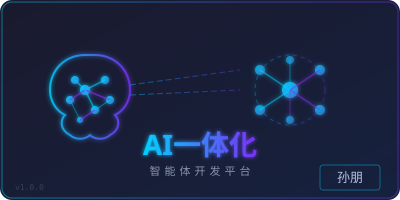

<p align="center">
  
</p>

# AI 脚手架项目 (AI Scaffold)

> **署名：孙朋** | AI一体化智能体开发平台

## 项目概述

本项目是一个基于多 Agent 协作的 AI 开发脚手架体系，涵盖软件开发全生命周期的 6 个核心阶段，每个阶段配备 **生成 Agent + 审核 Agent**，确保交付质量。

## 架构总览

```
┌─────────────────────────────────────────────────────────────┐
│                    人工审核层 (Human Review)                   │
│              所有环节必须经过人工审核后才能流转                      │
├─────────────────────────────────────────────────────────────┤
│                                                               │
│  ┌──────────┐  ┌──────────┐  ┌──────────┐  ┌──────────┐    │
│  │ 项目管理  │→│ 需求层面  │→│ 设计层面  │→│ 开发层面  │    │
│  │ Agent    │  │ Agent    │  │ Agent    │  │ Agent    │    │
│  │ + 审核   │  │ + 审核   │  │ + 审核   │  │ + 审核   │    │
│  └──────────┘  └──────────┘  └──────────┘  └──────────┘    │
│                                               ↓              │
│                  ┌──────────┐  ┌──────────┐                  │
│                  │ 部署上线  │←│ 测试层面  │                  │
│                  │ Agent    │  │ Agent    │                  │
│                  │ + 审核   │  │ + 审核   │                  │
│                  └──────────┘  └──────────┘                  │
│                                                               │
├─────────────────────────────────────────────────────────────┤
│                    共享层 (Shared Resources)                   │
│         模板 | 标准规范 | 词根字典 | 审核规则                      │
└─────────────────────────────────────────────────────────────┘
```

## 目录结构

```
ai-scaffold/
├── README.md                          # 项目说明
├── WORKFLOW.md                        # 审核流程说明
├── shared/                            # 共享资源
│   ├── templates/                     # 通用模板
│   │   ├── agent-template.md          # Agent 标准模板
│   │   └── skill-template.md          # Skill 标准模板
│   ├── standards/                     # 规范标准
│   │   ├── zhongzheng-standard.md     # 中证开发规范
│   │   └── review-scoring.md          # 审核评分标准
│   └── dictionaries/                  # 词根字典
│       └── root-dictionary.md         # 词根定义字典
├── agents/
│   ├── project-manager/               # 项目管理
│   │   ├── AGENT.md
│   │   ├── review/
│   │   │   └── REVIEW-AGENT.md
│   │   └── skills/
│   │       ├── project-init.md
│   │       ├── project-plan.md
│   │       ├── risk-manage.md
│   │       ├── progress-track.md
│   │       └── project-close.md
│   ├── requirement/                   # 需求层面
│   │   ├── AGENT.md
│   │   ├── review/
│   │   │   └── REVIEW-AGENT.md
│   │   └── skills/
│   │       ├── requirement-gather.md
│   │       ├── requirement-analysis.md
│   │       ├── requirement-spec.md
│   │       ├── requirement-validate.md
│   │       └── requirement-change.md
│   ├── design/                        # 设计层面
│   │   ├── AGENT.md
│   │   ├── review/
│   │   │   └── REVIEW-AGENT.md
│   │   └── skills/
│   │       ├── architecture-design.md
│   │       ├── tech-stack-select.md
│   │       ├── dictionary-standard.md
│   │       ├── permission-design.md
│   │       ├── performance-design.md
│   │       ├── security-design.md
│   │       ├── root-standard.md
│   │       ├── zhongzheng-compliance.md
│   │       └── api-design.md
│   ├── development/                   # 开发层面
│   │   ├── AGENT.md
│   │   ├── review/
│   │   │   └── REVIEW-AGENT.md
│   │   └── skills/
│   │       ├── code-generate.md
│   │       ├── zhongzheng-dev-standard.md
│   │       ├── architecture-layer.md
│   │       ├── annotation-standard.md
│   │       ├── code-review.md
│   │       ├── unit-test.md
│   │       └── code-refactor.md
│   ├── testing/                       # 测试层面
│   │   ├── AGENT.md
│   │   ├── review/
│   │   │   └── REVIEW-AGENT.md
│   │   └── skills/
│   │       ├── test-plan.md
│   │       ├── test-case.md
│   │       ├── test-execute.md
│   │       ├── bug-manage.md
│   │       └── test-report.md
│   └── deployment/                    # 部署上线
│       ├── AGENT.md
│       ├── review/
│       │   └── REVIEW-AGENT.md
│       └── skills/
│           ├── deploy-plan.md
│           ├── environment-setup.md
│           ├── deploy-execute.md
│           ├── rollback.md
│           └── go-live.md
```

## 核心原则

1. **中证贯标**: 所有设计和开发活动必须符合中证体系规范
2. **词根驱动**: 使用统一的词根字典确保术语一致性
3. **审核闭环**: 每个环节必须经过生成→审核→人工确认的完整流程
4. **可追溯性**: 所有产出物均可追溯到源头需求

## 快速开始

1. 阅读 `WORKFLOW.md` 了解完整审核流程
2. 从 `agents/project-manager/` 开始第一个项目
3. 按照流程顺序推进，每个环节完成后等待审核通过
