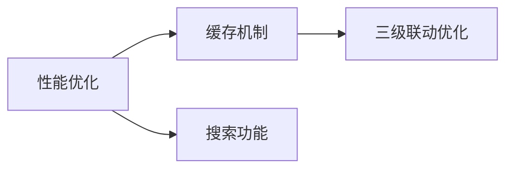

# 需求分析报告

## 基本信息
- 项目名称：在线商城后端系统 - 地址管理模块优化
- 分析日期：2026-05-29
- 分析人：孙朋

## 1. 可行性分析

### 1.1 技术可行性
| 需求 | 技术可行性 | 说明 |
|------|------------|------|
| REQ-001 | 高 | 使用MyBatis-Plus索引优化，技术成熟 |
| REQ-002 | 高 | Redis缓存方案成熟，项目已有Redis依赖 |
| REQ-003 | 高 | 使用Hibernate Validator，技术简单 |
| REQ-004 | 高 | 区域数据已存在，优化查询即可 |
| REQ-005 | 中 | 需要实现模糊搜索，可能需要全文索引 |
| REQ-006 | 中 | 需要处理Excel导入导出，技术成熟 |
| REQ-007 | 高 | 数据库字段扩展，技术简单 |
| REQ-008 | 中 | 需要设计历史记录表，有一定复杂度 |
| REQ-009 | 高 | 批量操作，技术简单 |
| REQ-010 | 高 | 配置化管理，技术简单 |

### 1.2 经济可行性
| 需求 | 投入成本 | 预期收益 | 经济可行性 |
|------|----------|----------|------------|
| REQ-001 | 低 | 高 | 高 |
| REQ-002 | 中 | 高 | 高 |
| REQ-003 | 低 | 中 | 高 |
| REQ-004 | 低 | 中 | 高 |
| REQ-005 | 中 | 中 | 中 |
| REQ-006 | 中 | 低 | 低 |
| REQ-007 | 低 | 低 | 中 |
| REQ-008 | 中 | 低 | 低 |
| REQ-009 | 低 | 低 | 中 |
| REQ-010 | 低 | 低 | 中 |

### 1.3 操作可行性
- 所有需求不影响现有业务流程
- 用户界面可复用现有组件
- 操作习惯保持一致

### 1.4 时间可行性
- 项目周期：2026-05-29 ~ 2026-06-25
- 开发时间：约15个工作日
- 可完成需求：P0 + P1 + 部分P2

## 2. 优先级评估

### 2.1 优先级矩阵

| 维度 | 权重 | 说明 |
|------|------|------|
| 业务价值 | 40% | 对业务的贡献度 |
| 技术复杂度 | 30% | 实现难度（分数越高越简单） |
| 风险程度 | 20% | 风险大小（分数越高风险越低） |
| 依赖关系 | 10% | 依赖多少（分数越高依赖越少） |

### 2.2 需求优先级评分

| 编号 | 需求描述 | 业务价值 | 技术复杂度 | 风险 | 依赖 | 总分 | 优先级 |
|------|----------|----------|------------|------|------|------|--------|
| REQ-001 | 地址列表查询性能优化 | 9 | 8 | 8 | 9 | 8.5 | P0 |
| REQ-002 | 地址数据缓存机制 | 9 | 7 | 7 | 8 | 8.1 | P0 |
| REQ-003 | 地址输入验证增强 | 7 | 9 | 9 | 9 | 8.0 | P1 |
| REQ-004 | 省市区三级联动数据优化 | 7 | 8 | 8 | 7 | 7.5 | P1 |
| REQ-005 | 地址搜索功能 | 6 | 6 | 6 | 5 | 5.9 | P1 |
| REQ-006 | 地址导入导出功能 | 4 | 6 | 7 | 6 | 5.2 | P2 |
| REQ-007 | 地址标签功能 | 5 | 8 | 9 | 8 | 6.6 | P2 |
| REQ-008 | 地址历史记录 | 4 | 5 | 6 | 4 | 4.7 | P2 |
| REQ-009 | 批量删除地址 | 5 | 8 | 8 | 7 | 6.5 | P2 |
| REQ-010 | 地址数量限制配置化 | 5 | 8 | 9 | 8 | 6.6 | P2 |

### 2.3 优先级定义
- **P0（必须有）**：核心功能，必须实现
  - REQ-001: 地址列表查询性能优化
  - REQ-002: 地址数据缓存机制

- **P1（应该有）**：重要功能，应该实现
  - REQ-003: 地址输入验证增强
  - REQ-004: 省市区三级联动数据优化
  - REQ-005: 地址搜索功能

- **P2（可以有）**：次要功能，可以实现
  - REQ-006: 地址导入导出功能
  - REQ-007: 地址标签功能
  - REQ-008: 地址历史记录
  - REQ-009: 批量删除地址
  - REQ-010: 地址数量限制配置化

## 3. 依赖分析

### 3.1 需求依赖关系

### 3.2 依赖说明

| 需求 | 依赖需求 | 依赖类型 | 说明 |
|------|----------|----------|------|
| REQ-002 | REQ-001 | 强依赖 | 缓存机制依赖于查询优化 |
| REQ-004 | REQ-002 | 弱依赖 | 三级联动可使用缓存提升性能 |
| REQ-005 | REQ-001 | 弱依赖 | 搜索功能可受益于查询优化 |

## 4. 冲突检测

### 4.1 需求矛盾检测
- 未发现需求矛盾

### 4.2 资源冲突检测
- 开发资源：1人全职开发
- 时间资源：约15个工作日
- 建议：优先实现P0和P1需求

### 4.3 时间冲突检测
- 里程碑时间紧张
- 建议：P2需求可安排在后续迭代

## 5. 风险评估

| 风险 | 可能性 | 影响 | 应对措施 |
|------|--------|------|----------|
| 技术难点攻关时间不足 | 中 | 高 | 预留缓冲时间，及时求助 |
| 需求变更频繁 | 低 | 中 | 建立变更控制流程 |
| 性能优化效果不明显 | 低 | 中 | 多种优化方案并行尝试 |

## 6. 建议

### 6.1 开发计划建议
1. **第一阶段（2026-06-01 ~ 2026-06-08）**：实现P0需求
   - REQ-001: 地址列表查询性能优化
   - REQ-002: 地址数据缓存机制

2. **第二阶段（2026-06-08 ~ 2026-06-10）**：实现P1需求
   - REQ-003: 地址输入验证增强
   - REQ-004: 省市区三级联动数据优化

3. **第三阶段（2026-06-10 ~ 2026-06-15）**：实现部分P2需求
   - REQ-005: 地址搜索功能
   - 根据时间安排选择性实现其他P2需求

### 6.2 技术方案建议
1. 使用数据库索引优化查询性能
2. 使用Redis缓存热点数据
3. 使用Hibernate Validator增强验证
4. 使用MyBatis-Plus分页插件优化列表查询

## 7. 结论

1. 所有需求技术可行
2. 建议优先实现P0和P1需求
3. P2需求可安排在后续迭代
4. 项目时间紧张，需严格控制范围
