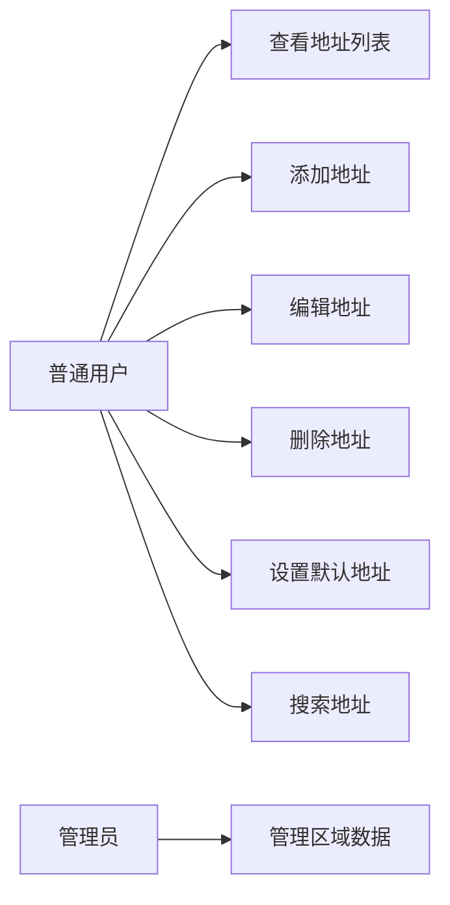

# 用例文档

## 用例图

## 用例描述

### UC1：查看地址列表
- **用例编号**：UC-001
- **用例名称**：查看地址列表
- **参与者**：普通用户
- **前置条件**：用户已登录
- **后置条件**：显示用户的所有地址列表
- **主成功场景**：
  1. 用户进入地址管理页面
  2. 系统查询用户的地址列表
  3. 系统显示地址列表，默认地址排在最前
- **扩展场景**：
  - 2a. 用户没有地址：显示空状态提示
- **特殊需求**：响应时间 < 100ms

### UC2：添加地址
- **用例编号**：UC-002
- **用例名称**：添加地址
- **参与者**：普通用户
- **前置条件**：用户已登录
- **后置条件**：新地址保存成功
- **主成功场景**：
  1. 用户点击"添加地址"按钮
  2. 系统显示地址编辑表单
  3. 用户填写地址信息（收货人、手机号、省市区、详细地址）
  4. 用户点击"保存"按钮
  5. 系统验证输入信息
  6. 系统保存地址
  7. 系统提示"添加成功"
- **扩展场景**：
  - 5a. 验证失败：显示具体错误信息
  - 6a. 保存失败：显示错误提示
- **特殊需求**：支持省市区三级联动选择

### UC3：编辑地址
- **用例编号**：UC-003
- **用例名称**：编辑地址
- **参与者**：普通用户
- **前置条件**：用户已登录，地址存在
- **后置条件**：地址信息更新成功
- **主成功场景**：
  1. 用户点击某个地址的"编辑"按钮
  2. 系统显示地址编辑表单，填充现有数据
  3. 用户修改地址信息
  4. 用户点击"保存"按钮
  5. 系统验证输入信息
  6. 系统更新地址
  7. 系统提示"更新成功"
- **扩展场景**：
  - 5a. 验证失败：显示具体错误信息
  - 6a. 更新失败：显示错误提示
- **特殊需求**：无

### UC4：删除地址
- **用例编号**：UC-004
- **用例名称**：删除地址
- **参与者**：普通用户
- **前置条件**：用户已登录，地址存在
- **后置条件**：地址删除成功
- **主成功场景**：
  1. 用户点击某个地址的"删除"按钮
  2. 系统提示"确认删除？"
  3. 用户确认删除
  4. 系统删除地址
  5. 系统提示"删除成功"
- **扩展场景**：
  - 3a. 用户取消删除：返回地址列表
  - 4a. 删除失败：显示错误提示
- **特殊需求**：如果删除的是默认地址，自动将下一个地址设为默认

### UC5：设置默认地址
- **用例编号**：UC-005
- **用例名称**：设置默认地址
- **参与者**：普通用户
- **前置条件**：用户已登录，地址存在
- **后置条件**：默认地址设置成功
- **主成功场景**：
  1. 用户点击某个地址的"设为默认"按钮
  2. 系统取消其他地址的默认状态
  3. 系统设置当前地址为默认
  4. 系统提示"设置成功"
- **扩展场景**：
  - 3a. 设置失败：显示错误提示
- **特殊需求**：无

### UC6：搜索地址
- **用例编号**：UC-006
- **用例名称**：搜索地址
- **参与者**：普通用户
- **前置条件**：用户已登录
- **后置条件**：显示匹配的地址列表
- **主成功场景**：
  1. 用户在搜索框输入关键词
  2. 系统在详细地址、收货人、手机号字段中搜索
  3. 系统显示匹配的地址列表
- **扩展场景**：
  - 3a. 没有匹配结果：显示空状态提示
- **特殊需求**：支持模糊匹配

### UC7：管理区域数据
- **用例编号**：UC-007
- **用例名称**：管理区域数据
- **参与者**：管理员
- **前置条件**：管理员已登录
- **后置条件**：区域数据更新成功
- **主成功场景**：
  1. 管理员进入区域数据管理页面
  2. 管理员查看、编辑区域数据
  3. 管理员保存修改
  4. 系统更新区域数据
- **扩展场景**：
  - 3a. 保存失败：显示错误提示
- **特殊需求**：无
