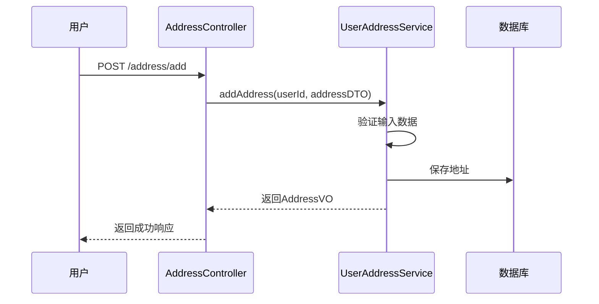
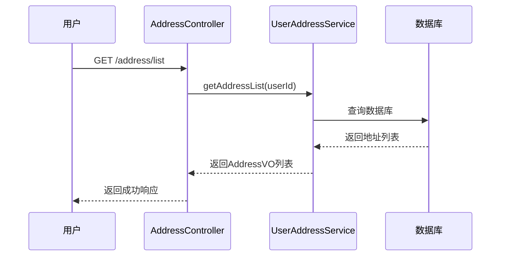

# 架构设计文档

## 1. 概述

### 1.1 设计目标
优化地址管理模块的架构，提升系统性能、可扩展性和可维护性。

### 1.2 设计原则
- **高性能**：通过索引优化提升查询性能
- **可扩展**：支持未来功能扩展
- **可维护**：代码结构清晰，易于维护
- **安全性**：保护用户数据安全

### 1.3 约束条件
- 保持现有API接口兼容性
- 不影响现有业务流程
- 使用现有技术栈

## 2. 架构风格

### 2.1 架构选型
采用**分层架构**，将系统分为表现层、应用层、领域层和基础设施层。

### 2.2 分层设计
```
┌─────────────────────────────────────┐
│           表现层 (Controller)        │
│           接口层、参数校验            │
├─────────────────────────────────────┤
│           应用层 (Service)           │
│           业务逻辑、事务管理          │
├─────────────────────────────────────┤
│           领域层 (Entity/DTO/VO)     │
│           实体、数据传输对象          │
├─────────────────────────────────────┤
│           基础设施层 (Mapper/Config) │
│           数据访问、配置管理          │
└─────────────────────────────────────┘
```

## 3. 技术架构

### 3.1 技术栈
| 层次 | 技术 | 说明 |
|------|------|------|
| 后端框架 | Spring Boot 2.7 | 基础框架 |
| ORM框架 | MyBatis-Plus 3.5.x | 数据库操作 |
| 数据库 | MySQL 5.7+ | 关系型数据库 |
| 认证 | JWT | Token认证 |
| API文档 | Swagger 3.0 | 接口文档 |

### 3.2 组件设计

#### 地址管理模块组件
```
AddressController
├── GET /address/list          # 获取地址列表
├── GET /address/{id}          # 获取地址详情
├── POST /address/add          # 添加地址
├── PUT /address/update        # 更新地址
├── DELETE /address/{id}       # 删除地址
├── PUT /address/default/{id}  # 设置默认地址
└── GET /address/default       # 获取默认地址

UserAddressService
├── getAddressList()           # 获取地址列表
├── getAddressById()           # 获取地址详情
├── addAddress()               # 添加地址
├── updateAddress()            # 更新地址
├── deleteAddress()            # 删除地址
├── setDefaultAddress()        # 设置默认地址
└── getDefaultAddress()        # 获取默认地址

UserAddressServiceImpl
├── 数据验证                    # 输入数据验证
└── 数据转换                    # Entity/VO转换

UserAddressMapper
├── 数据库操作                  # CRUD操作
└── 索引优化                    # 查询优化
```

## 3. 业务架构

### 3.1 业务模块
```
地址管理模块
├── 地址CRUD
│   ├── 添加地址
│   ├── 编辑地址
│   ├── 删除地址
│   └── 查询地址
├── 默认地址管理
│   ├── 设置默认地址
│   └── 获取默认地址
└── 地址验证
    ├── 手机号验证
    ├── 邮编验证
    └── 地址格式验证
```

### 3.2 业务流程

#### 添加地址流程


#### 获取地址列表流程


## 4. 数据架构

### 4.1 数据模型

#### 用户地址表 (user_addr_tb)
```sql
CREATE TABLE user_addr_tb (
    id VARCHAR(32) NOT NULL,
    user_id VARCHAR(32) NULL COMMENT '用户标识',
    rcvr_name VARCHAR(100) NULL COMMENT '收货人姓名',
    rcvr_tel VARCHAR(20) NULL COMMENT '收货人电话',
    prvc_cde VARCHAR(10) NULL COMMENT '省份编码',
    city_cde VARCHAR(10) NULL COMMENT '城市编码',
    dstrct_cde VARCHAR(10) NULL COMMENT '区县编码',
    dtl_addr VARCHAR(500) NULL COMMENT '详细地址',
    dft_indc CHAR(1) DEFAULT 'N' NULL COMMENT '是否默认标志 Y-是 N-否',
    entr_psn_id VARCHAR(32) NULL COMMENT '创建人标识',
    entr_psn_name VARCHAR(100) NULL COMMENT '创建人姓名',
    entr_time TIMESTAMP NULL COMMENT '创建时间',
    last_alter_psn_id VARCHAR(32) NULL COMMENT '最后修改人标识',
    last_alter_psn_name VARCHAR(100) NULL COMMENT '最后修改人姓名',
    last_alter_time TIMESTAMP NULL COMMENT '最后修改时间',
    vld_sts_cde CHAR(1) DEFAULT 'N' NULL COMMENT '删除标志 Y-是 N-否',
    PRIMARY KEY (id),
    INDEX idx_user_addr_user_id (user_id),
    INDEX idx_user_addr_user_id_dft (user_id, dft_indc, entr_time)
) COMMENT '用户地址表';
```

#### 区域表 (region_tb)
```sql
CREATE TABLE region_tb (
    id VARCHAR(32) NOT NULL,
    cde VARCHAR(10) NOT NULL COMMENT '区域编码',
    name VARCHAR(100) NOT NULL COMMENT '区域名称',
    prnt_cde VARCHAR(10) NULL COMMENT '父级编码',
    lvl INTEGER NULL COMMENT '级别 1-省 2-市 3-区',
    entr_psn_id VARCHAR(32) NULL COMMENT '创建人标识',
    entr_psn_name VARCHAR(100) NULL COMMENT '创建人姓名',
    entr_time TIMESTAMP NULL COMMENT '创建时间',
    last_alter_psn_id VARCHAR(32) NULL COMMENT '最后修改人标识',
    last_alter_psn_name VARCHAR(100) NULL COMMENT '最后修改人姓名',
    last_alter_time TIMESTAMP NULL COMMENT '最后修改时间',
    vld_sts_cde CHAR(1) DEFAULT 'N' NULL COMMENT '删除标志 Y-是 N-否',
    PRIMARY KEY (id),
    INDEX idx_region_cde (cde),
    INDEX idx_region_prnt_cde (prnt_cde)
) COMMENT '区域表';
```

> **词根规范说明**：表字段已按ATTRC2E词根规范设计，详见 `docs/20-address-table-mapping.md` 映射表。

### 4.2 数据流

#### 地址数据流
```
用户输入 → 参数校验 → 业务处理 → 数据库存储 → 响应返回
```

## 5. 部署架构

### 5.1 部署拓扑
```
┌─────────────┐     ┌─────────────┐     ┌─────────────┐
│   Nginx     │────>│ Spring Boot │────>│   MySQL     │
│  (反向代理)  │     │   应用服务   │     │   数据库    │
└─────────────┘     └─────────────┘     └─────────────┘
```

### 5.2 环境规划
| 环境 | 用途 | 配置 |
|------|------|------|
| 开发 | 开发测试 | 本地环境 |
| 测试 | 功能测试 | 测试服务器 |
| 预发 | 预发布验证 | 预发服务器 |
| 生产 | 正式运行 | 生产服务器 |

## 6. 安全架构

### 6.1 认证授权
- 使用JWT进行用户认证
- 地址数据只能被地址所有者访问
- 管理员可管理区域数据

### 6.2 数据安全
- 敏感信息（手机号）脱敏显示
- 防止SQL注入和XSS攻击
- 使用HTTPS加密传输

## 7. 性能设计

### 7.1 数据库优化
- 添加复合索引：user_id, dft_indc, entr_time
- 使用分页查询，避免一次性加载所有数据
- 优化查询语句，减少不必要的字段查询

### 7.2 性能指标
- 地址列表查询响应时间 < 100ms
- 支持1000并发用户

## 8. 高可用设计

### 8.1 容错机制
- 数据库连接池：配置合理的连接池参数
- 异常处理：统一异常处理机制

### 8.2 监控告警
- 接口响应时间监控
- 数据库连接池监控
